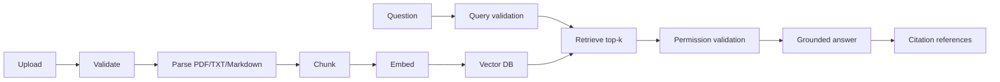

# AI Knowledge Base Assistant

This project is a product-oriented knowledge base assistant that supports uploading PDF, TXT, and Markdown documents, chunking them, embedding them with a real sentence-transformers model, indexing them in a vector database, and answering questions with citations and role-aware access control.

## Introduction

This directory is the standalone Product deliverable. It is not assembled from the seven classroom experiments under `Week22_Engineering`. The product accepts knowledge documents, indexes them, retrieves relevant chunks, applies permission and prompt checks, and presents source-grounded answers in a Flask web interface.

## Features

- Real document upload validation for PDF, TXT, and Markdown
- Real chunking pipeline with chunk size and overlap configuration
- Real embedding-based retrieval using SentenceTransformer
- Secure role-based filtering before retrieval
- Citation metadata including source file, page, and chunk id
- Web interface for upload and Q&A
- Test coverage for upload, citation, permissions, prompt filtering, and 20-question evaluation

## Retrieval mode

- Retrieval method: SentenceTransformer Embedding
- Generation mode: Retrieval-only prototype

This project does not claim to be a general-purpose external LLM integration. It uses embedding-based retrieval and citations, and the response path is designed to require grounded evidence in the current environment.

## Architecture



## Product structure

- `app.py`: web entry point (`python app.py`)
- `src/`: public Product API (`vector_database`, `retrieval`, `rag`, `upload`, `citation`)
- `security/`: document validation, prompt filter, and role/class permissions
- `templates/`: upload, question, answer, and source-reference UI
- `tests/`: executable Product tests
- `data/`: 56-file Product dataset and manifest
- `docs/`: architecture, user manual, model, security, testing, and reflection reports
- requirements.txt

## Installation

```bash
cd 第22周/Week22_AI_Knowledge_Base_Assistant
python -m venv .venv
source .venv/bin/activate
pip install -r requirements.txt
python app.py
```

## Usage

Open http://127.0.0.1:5000, upload a `.pdf`, `.txt`, or `.md` document, then ask a question using the same user role. The answer page displays citation numbers and, for each source, filename, page, section, document id, and chunk id.

## Security

The product validates extension, MIME type, size, empty content, duplicate content, and path traversal. Prompt injection patterns are rejected before retrieval. Role, owner, private, and class permissions are enforced on indexed metadata before sources are returned. See `docs/security_analysis.md` for threat coverage and remaining risks.

## Testing

```bash
python -m pytest tests -q
```

The acceptance matrix in `docs/product_evaluation.md` records 20 questions with expected behavior, top-k, answer, citations, and pass status. Upload tests exercise all three supported file formats.

## Limitations

- The shipped answer generator is retrieval-only and does not call an external LLM.
- The in-memory vector database is rebuilt when the process restarts.
- Scanned PDFs without an extractable text layer need OCR before upload.

## Future Improvements

- Persist vectors and document metadata in a production database.
- Add an optional managed LLM with strict context-only generation.
- Add OCR, authentication, audit export, and browser-level automated screenshots.
